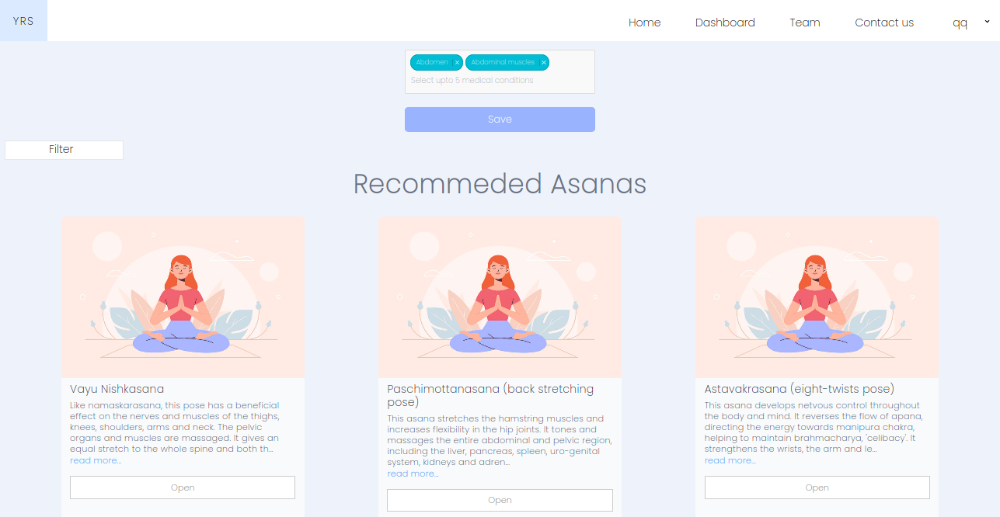
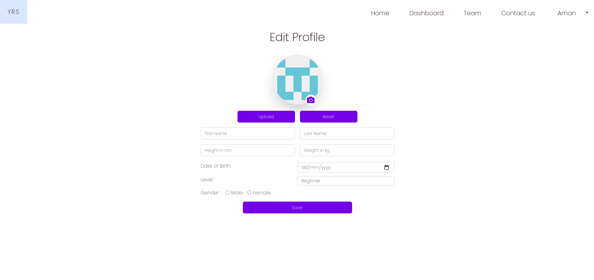
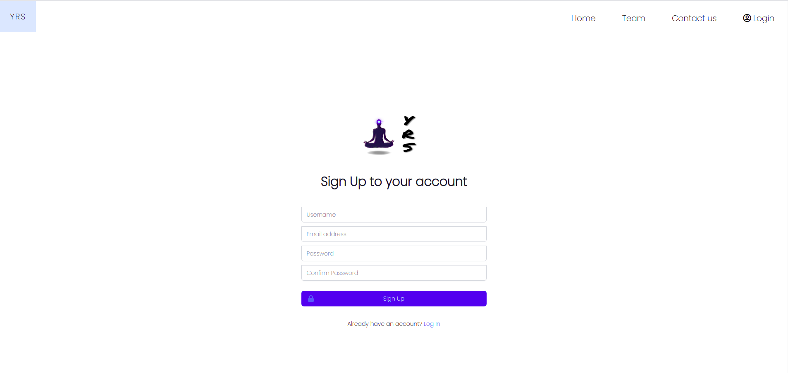

# Yoga Recommendation System

 

## Project Overview

Yoga is a 5000 years old psycho-spiritual technique that focuses on creating harmony between the mind and the body. The efficacy of Yoga has been proven for certain medical conditions.

There are more than 200 postures and pranayamas with specific benefits that constitute Yoga. One needs an able yoga teacher to identify the cause of suffering and decide postures and pranayamas. In the absence of such a teacher, the Internet is where one searches for information. A simple google search on keyword yoga asanas has over a billion results. It is a challenge to extract correct and reliable information. The information available on the websites is incomplete, unreliable and not verifiable.

In this project, we propose a machine learning-based yoga recommendation system that can recommend asanas based on the user's medical conditions.

## Website

### Home Page

### Dashboard

### Profile Page

### SignUp

### Entity Relationship Diagram (ERD)

## Results

Following are some of the recommendations based on the medical conditions

1. Obesity, Constipation
   - Eka Pada Sirsasana
   - Skandha Chakra
   - Manibandha Chakra
   - Greeva Sanchalana
   - Jyestikasana
2. Height Problem
   - Parvatasana
   - Kati Chakrasana
   - Vayu Nishkasana
   - Ujjayi Pranayama
   - Supta Pawanmuktasana
3. Depression
   - Trikonasana
   - Eka Padasana
   - Pada Prasar Paschimottanasana
   - Astavakrasana
   - Ananda Madirasana

## Installation procedure

1. Install PHP 7.4
2. Install MySQL
3. Install NodeJs and NPM
4. Install Composer (Change path of composer link)
5. Install Laravel 8
6. Install Python (version 3.6 or above)
7. Install Tensorflow (2.2.1 version)
8. Set up MySQL
   - Create a database
   - Grant All privileges to the user created using root
9. Clone the Project
10. cd into your project
11. Run the following commands in the project directory
    - composer install
    - npm install
    - cp .env.example .env
    - Setup the .env file (set
      - DB_NAME,
      - DB_USERNAME,
      - DB_PASSWORD,
      - Mail_Trap - Sign up on mailtrap and paste mail credentials provided by it in .env)
    - php artisan key:generate
    - php artisan migrate:fresh
    - mkdir /public/storage/profile_images/ (this folder stores profile images)
    - php artisan storage:link
    - mysql -u DB_USERNAME -p DB_NAME < asanas_data.sql
    - mysql -u DB_USERNAME -p DB_NAME < disease_data.sql
    - php artisan serve
